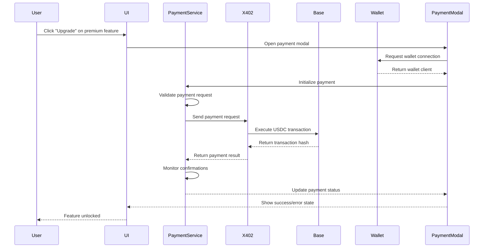

# X402 Payment Flow Implementation

This document outlines the implementation of the x402 payment flow for HealthSync, enabling USDC payments on Base network for premium features.

## Overview

The x402 payment integration allows users to purchase premium features using USDC on the Base network. The implementation includes:

- **Payment Service**: Core payment processing using x402-axios
- **Wallet Integration**: wagmi useWalletClient for wallet connectivity
- **Premium Features**: Modular premium feature system
- **Transaction Monitoring**: Real-time transaction confirmation tracking
- **Error Handling**: Robust error handling with retry logic

## Architecture

### Core Components

1. **PaymentService** (`lib/payment.ts`)
   - Handles x402-axios integration
   - Manages USDC transactions on Base
   - Provides transaction status monitoring
   - Implements error handling and retry logic

2. **PaymentModal** (`components/PaymentModal.tsx`)
   - User interface for payment processing
   - Real-time payment status updates
   - Transaction confirmation display
   - Error state management

3. **PremiumFeatures** (`components/PremiumFeatures.tsx`)
   - Premium feature showcase
   - Feature unlock management
   - Payment flow initiation

### Payment Flow



## Implementation Details

### 1. X402 Integration

```typescript
// X402 client configuration
const X402_CONFIG = {
  baseURL: 'https://api.x402.com',
  timeout: 30000,
  retries: 3,
};

// Initialize payment through x402
const x402Request = {
  method: 'POST',
  url: '/payments/usdc',
  data: {
    amount: amountInWei.toString(),
    recipient: request.recipient,
    token: USDC_CONTRACT_ADDRESS,
    chain: base.id,
    description: request.description,
    metadata: request.metadata,
  },
};

const response = await this.x402Client.request(x402Request);
```

### 2. Wagmi Integration

```typescript
// Wagmi configuration for Base network
const config = createConfig({
  chains: [base],
  connectors: [
    coinbaseWallet({
      appName: 'HealthSync',
      appLogoUrl: 'https://healthsync.app/logo.png',
    }),
  ],
  transports: {
    [base.id]: http(),
  },
});

// Using wallet client in payment service
const { data: walletClient } = useWalletClient();
const paymentService = createPaymentService(walletClient);
```

### 3. USDC on Base

- **Contract Address**: `0x833589fCD6eDb6E08f4c7C32D4f71b54bdA02913`
- **Decimals**: 6
- **Network**: Base (Chain ID: 8453)

### 4. Premium Features

Available premium features with USDC pricing:

| Feature | Price | Description |
|---------|-------|-------------|
| AI Health Insights | $2.99 USDC | Personalized health insights powered by AI |
| Advanced Analytics | $4.99 USDC | Detailed health trends and predictive analytics |
| Telemedicine Integration | $9.99 USDC | Connect with healthcare providers directly |
| Premium Storage | $1.99 USDC | Unlimited health record storage |

## Testing

### Running Tests

```typescript
import { runAllPaymentTests } from './lib/payment-test';

// Run all payment integration tests
const results = await runAllPaymentTests();
```

### Test Coverage

- ✅ Payment service initialization
- ✅ USDC balance retrieval
- ✅ Payment request validation
- ✅ Transaction status monitoring
- ✅ Error handling and retry logic

### Manual Testing Checklist

- [ ] Connect wallet successfully
- [ ] Display correct USDC balance
- [ ] Process payment through x402
- [ ] Monitor transaction confirmations
- [ ] Handle payment errors gracefully
- [ ] Unlock premium features after payment
- [ ] Verify transaction on BaseScan

## Security Considerations

1. **Input Validation**: All payment requests are validated before processing
2. **Amount Verification**: USDC amounts are properly converted and validated
3. **Address Validation**: Recipient addresses are validated before transactions
4. **Error Handling**: Sensitive error information is not exposed to users
5. **Transaction Monitoring**: Confirmations are tracked to ensure payment completion

## Error Handling

The implementation includes comprehensive error handling:

```typescript
// Retry logic for failed payments
async handlePaymentError(error: any, request: PaymentRequest, retryCount = 0) {
  const maxRetries = 3;
  
  if (retryCount < maxRetries) {
    await new Promise(resolve => setTimeout(resolve, 1000 * (retryCount + 1)));
    return this.initializePayment(request);
  }
  
  return {
    success: false,
    error: `Payment failed after ${maxRetries} attempts: ${error.message}`,
  };
}
```

## Configuration

### Environment Variables

```env
NEXT_PUBLIC_ONCHAINKIT_API_KEY=your_onchainkit_api_key
```

### X402 Configuration

Update the X402_CONFIG in `lib/payment.ts` with your actual API endpoint:

```typescript
const X402_CONFIG = {
  baseURL: 'https://your-x402-api.com',
  timeout: 30000,
  retries: 3,
};
```

## Deployment Checklist

- [ ] Configure X402 API endpoint
- [ ] Set up OnchainKit API key
- [ ] Test on Base testnet first
- [ ] Verify USDC contract address
- [ ] Test wallet connectivity
- [ ] Validate payment flow end-to-end
- [ ] Monitor transaction confirmations
- [ ] Test error scenarios

## Future Enhancements

1. **Subscription Payments**: Implement recurring payments for subscription features
2. **Multi-Token Support**: Add support for other tokens besides USDC
3. **Payment History**: Track and display user payment history
4. **Refund System**: Implement refund functionality for failed transactions
5. **Analytics**: Add payment analytics and reporting
6. **Mobile Optimization**: Optimize payment flow for mobile devices

## Support

For issues with the x402 integration:

1. Check the browser console for error messages
2. Verify wallet connection and Base network
3. Ensure sufficient USDC balance
4. Check transaction status on BaseScan
5. Review error logs in payment service

## Resources

- [X402 Documentation](https://docs.x402.com)
- [Wagmi Documentation](https://wagmi.sh)
- [Base Network Documentation](https://docs.base.org)
- [OnchainKit Documentation](https://onchainkit.xyz)
- [USDC on Base](https://basescan.org/token/0x833589fCD6eDb6E08f4c7C32D4f71b54bdA02913)
